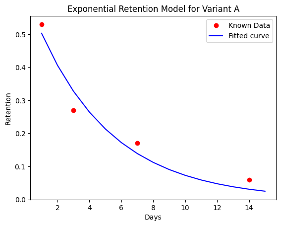
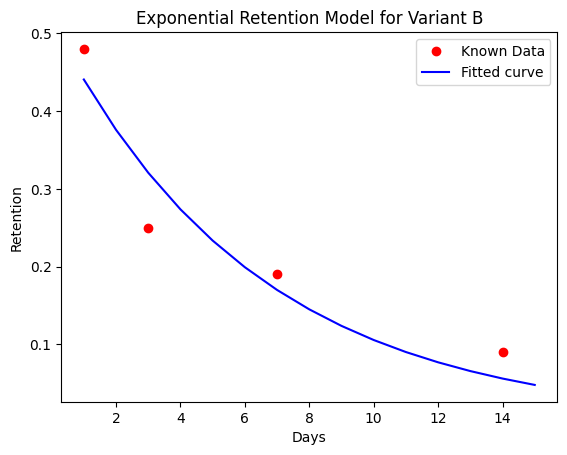

# 📊 Project Overview

This project consists of two independent data analysis tasks.

- Task 1 compares two variants using a simple 7×2 table to determine the better-performing option.

- Task 2 analyzes a large dataset containing approximately 7 million rows to extract insights and draw data-driven conclusions.

Each task is approached independently and uses methods appropriate to the size and structure of its data.

# General file structure:

- **`src/`**: Contains utility functions
  - **[`stats_utils.py`](src/stats_utils.py)**: Statistical utility functions for analyzing and explaining data
  - **[`visual_utils.py`](src/visual_utils.py)**: Utility functions for data visualization
  - **[`process_data.py`](src/process_data.py)**: Processes raw data and writes it to CSV for use in other tools

### Task 1:

- **[`AB_testing.ipynb`](AB_testing.ipynb)**: Analysis for task 1

### Task 2:

- **[`general_analysis.ipynb`](general_analysis.ipynb)**: Overall analysis of data
- **[`first_day_segments.ipynb`](first_day_segments.ipynb)**: Analysis of data segmented by first-day behaviour
- **[`country_analysis.ipynb`](country_analysis.ipynb)**: Analysis of data segmented by countries
- **[`install_day_segments.ipynb`](install_day_segments.ipynb)**: Analysis of data segmented day of install

# Task 1: A/B Testing Analysis

## Overview

In this part, I performed **A/B testing** on two game variants to determine the more profitable option.

I will not go into the calculation and implementation details here, as they are explained in detail in the Python scripts and Jupyter notebooks.

## Tech Used

Python **3.12** with **Jupyter Notebook** was used for the analysis.

## File Structure

Utility functions for this part are implemented in **[`stats_utils.py`](src/stats_utils.py)** and **[`visual_utils.py`](src/visual_utils.py)**.  
The main analysis is done in **[`AB_testing.ipynb`](AB_testing.ipynb)**.

## Methodology

I used the provided retention values to fit a general retention curve and used the parameters to approximate missing values and calculate the needed values.

## Assumptions

- There are exactly 20,000 installs per day. (And another constant value in Part E)
- Average money spent by players is the same (or difference is negligible) for the variants.
- Sales does not affect anything other than purchase rate including average money spent by players, retentions, installs etc. (for Part D).
- Assuming There are no significant differences in cost, resource usage, or time required. (for Part F)

## Results

The following are fitted retention curves for variants.

### Part A

Daily active users after 15 days:

- Variant A: 50011
- Variant B: 54454

Percentage difference between the results is 8.88%

Verdict: Variant B is the better option.

### Part B

Assuming average money spent by players per day is the same (or difference is negligible) for the variants.

Total revenue by day 15 (not including that day):

- Variant A: 21054.21
- Variant B: 22383.04

Percentage difference between the results is 6.31%

Verdict: Variant B is the better option.

### Part C

Assuming average money spent by players per day is the same (or difference is negligible) for the variants.

Total revenue by day 30 (not including that day):

- Variant A: 52128.74
- Variant B: 58998.43

Percentage difference between the results is 13.18%

Verdict: Variant B is the better option.  
The choice is even stronger now, since the percentage difference doubled compared to 15 day result.

### Part D

Assuming sales does not affect anything other than purchase rate including average money spent by players, retentions, installs etc.

Total revenue by day 30 with a 10-day sale (days 15–24):

- Variant A: 57243.03
- Variant B: 64697.38

Percentage difference between the results is 13.02%

Revenue of both variants increased with this sale. Meaning that it was a good decision regardless of variants. Also, the variants are to be affected very similarly that percentage difference hardly changed.

Verdict:

- Variant B is still the better option.
- Sale was a success regardless of variant.

### Part E

Total revenue by day 30 with new source introduced on 20th:

- Variant A: 59392.37
- Variant B: 65906.49

Percentage difference between the results is 10.97%

The results are the best the variants have gor so far. Variant A benefits more from this update since percentage difference between the variants have decreased.

Verdict:

- Variant B is still the better option.
- Sale was a success regardless of variant
- Variant A benefitted more.

### Part F

Assuming there are no significant differences in cost, resource usage, or time required.

Conclusion: Just from the revenue perspective, adding a new source is a better choice.
